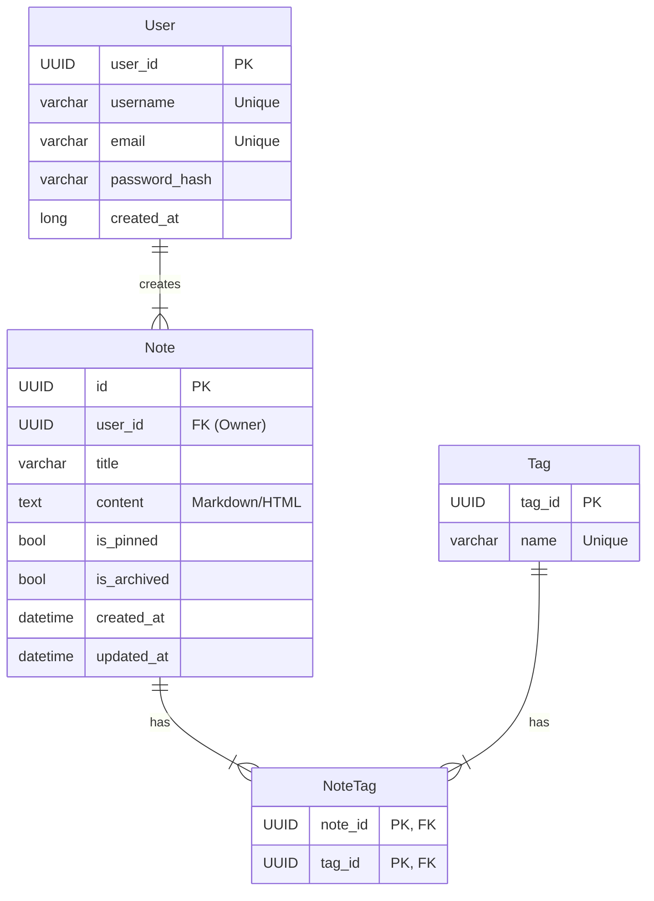

```mermaid
erDiagram
    User {
        UUID user_id "PK"
        varchar username "Unique"
        varchar email "Unique"
        varchar password_hash
        long created_at
    }

    Note {
        UUID id "PK"
        UUID user_id "FK (Owner)"
        varchar title
        text content "Markdown/HTML"
        bool is_pinned
        bool is_archived
        datetime created_at
        datetime updated_at
    }

    Tag {
        UUID tag_id "PK"
        varchar name "Unique"
    }

%%    -- Junction Tables for Many-to-Many Relationships

    NoteTag {
        UUID note_id "PK, FK"
        UUID tag_id "PK, FK"
    }

%%    -- Relationships
    User ||--|{ Note : "creates"
    Note ||--|{ NoteTag : "has"
    Tag  ||--|{ NoteTag : "has"
```